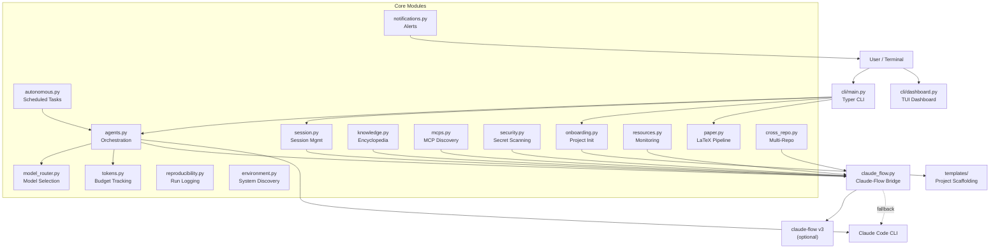
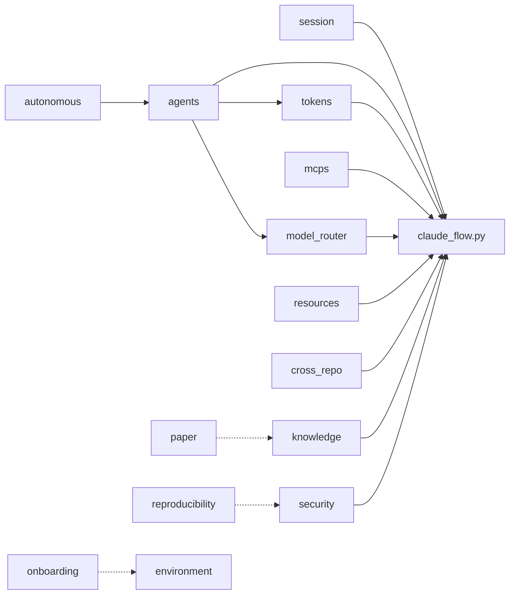
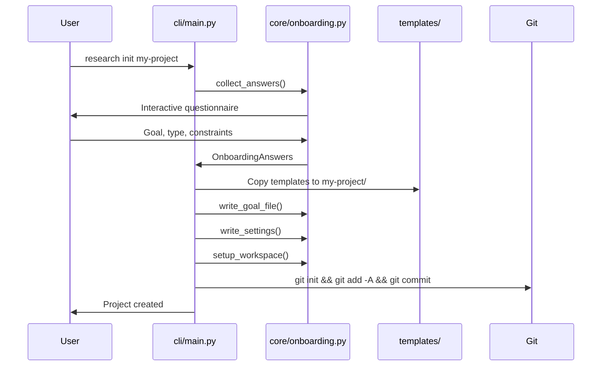
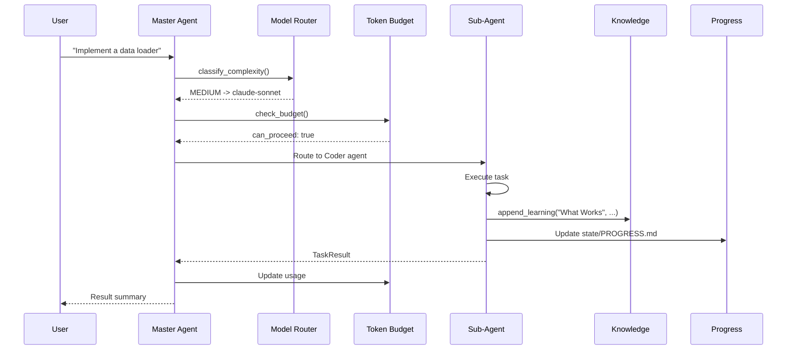
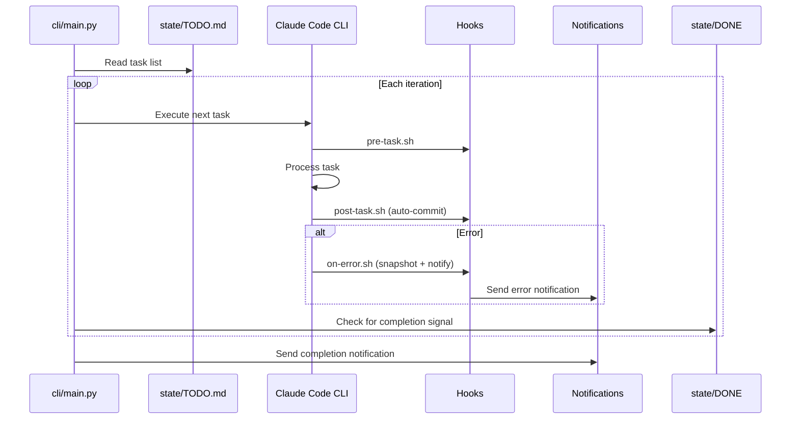
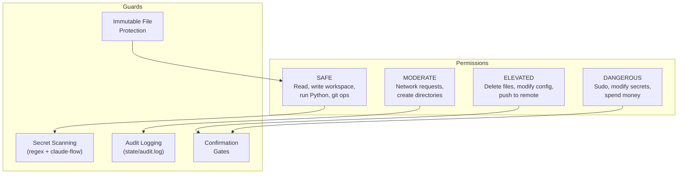
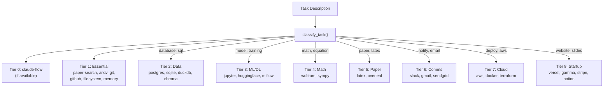

# Architecture

This page describes the system architecture, module relationships, and data flow within Research Automation.

---

## High-Level Architecture



---

## Module Dependency Map

The following diagram shows which core modules depend on which:



**Solid arrows** indicate direct imports. **Dashed arrows** indicate indirect or optional relationships.

### Key Observations

1. **`claude_flow.py` is the central integration point.** Nine modules import from it. Every module follows the same fallback pattern: try the bridge, catch `ClaudeFlowUnavailable`, fall back to a local implementation.

2. **`agents.py` is the primary orchestrator.** It uses `tokens.py` for budget checks and `model_router.py` for model selection before dispatching tasks.

3. **Domain-specific modules are isolated.** `paper.py`, `reproducibility.py`, `voice.py`, `style_transfer.py`, `meta_rules.py`, and `automation_utils.py` do not depend on the claude-flow bridge and operate independently.

4. **`onboarding.py` is entry-only.** It is called during `research init` and does not participate in ongoing session execution.

---

## Directory Structure

```
research-automation/
├── cli/                          # User-facing CLI
│   ├── main.py                   # Typer CLI: init, start, overnight, status, etc.
│   ├── dashboard.py              # Rich TUI dashboard
│   └── gallery.py                # Figure gallery viewer
│
├── core/                         # Business logic (20+ modules)
│   ├── agents.py                 # Agent types, routing, DAG execution
│   ├── session.py                # Session CRUD, snapshots
│   ├── tokens.py                 # Token estimation, budget checks
│   ├── knowledge.py              # Encyclopedia CRUD, vector search
│   ├── mcps.py                   # MCP tier loading, classification
│   ├── model_router.py           # Complexity classification, model selection
│   ├── security.py               # Secret scanning, immutable files
│   ├── paper.py                  # Figures, citations, LaTeX build
│   ├── reproducibility.py        # Run logs, artifact registry, hashing
│   ├── resources.py              # CPU/RAM/GPU monitoring, checkpoints
│   ├── notifications.py          # Slack, email, desktop alerts
│   ├── environment.py            # System discovery, conda management
│   ├── onboarding.py             # Interactive init questionnaire
│   ├── cross_repo.py             # Multi-repo linking, coordinated commits
│   ├── autonomous.py             # Scheduled routines, audit logging
│   ├── claude_flow.py            # Bridge to claude-flow v3
│   ├── style_transfer.py         # Writing style analysis, plagiarism check
│   ├── voice.py                  # Audio transcription
│   ├── meta_rules.py             # Rule extraction from conversations
│   ├── automation_utils.py       # Data helpers, experiment runners
│   ├── auto_debug.py             # Automatic error diagnosis
│   ├── browser.py                # Browser preview
│   ├── task_spooler.py           # Task queue management
│   └── verification.py           # Result verification
│
├── templates/                    # Copied into new projects
│   ├── config/                   # MCP config, settings template
│   │   └── mcp-nucleus.json      # 70+ MCPs in 8 tiers
│   ├── knowledge/                # GOAL.md, ENCYCLOPEDIA.md, CONSTRAINTS.md
│   └── paper/                    # main.tex, references.bib, Makefile
│
├── defaults/                     # Shared defaults (not copied into projects)
│   ├── PHILOSOPHY.md             # Core research principles
│   ├── LEGISLATION.md            # Non-negotiable rules
│   ├── CODE_STYLE.md             # Code style guide
│   ├── PROMPTS.md                # Default prompt collection
│   ├── MCP_NUCLEUS.json          # Master MCP catalog
│   └── ONBOARDING.md             # Onboarding question bank
│
├── docker/                       # Container setup
│   ├── Dockerfile                # Ubuntu 24.04 + full toolchain
│   ├── docker-compose.yml        # Volume mounts, resource limits
│   └── permissions.md            # Permission level documentation
│
├── scripts/                      # Shell scripts
│   ├── setup.sh                  # Initial setup
│   ├── setup_claude_flow.sh      # claude-flow installation
│   ├── overnight.sh              # Basic overnight runner
│   ├── overnight-enhanced.sh     # Enhanced overnight with recovery
│   └── interactive.sh            # Interactive session launcher
│
├── tests/                        # Test suite
├── docs/                         # Documentation
└── pyproject.toml                # Package metadata and dependencies
```

---

## Data Flow: Project Initialization



---

## Data Flow: Task Execution



---

## Data Flow: Overnight Mode



---

## Claude-Flow Integration Pattern

Every module that integrates with claude-flow follows the same pattern:

```python
from core.claude_flow import ClaudeFlowUnavailable, _get_bridge

def some_function(args):
    # Try claude-flow first
    try:
        bridge = _get_bridge()
        result = bridge.some_method(args)
        return adapt_result(result)
    except ClaudeFlowUnavailable:
        pass

    # Fall back to local implementation
    return local_implementation(args)
```

This ensures the system works identically with or without claude-flow installed. The bridge is a singleton (`_get_bridge()`) that checks for `npx` and `claude-flow@v3alpha` availability on first call.

### Agent Type Mapping

| Research Automation | claude-flow Equivalent |
|--------------------|-----------------------|
| MASTER | hierarchical-coordinator (queen) |
| RESEARCHER | researcher |
| CODER | coder |
| REVIEWER | code-reviewer |
| FALSIFIER | security-auditor |
| WRITER | api-docs |
| CLEANER | refactorer |

---

## Security Architecture



---

## MCP Tier Architecture



Tier 1 is always loaded. Other tiers activate when task keywords match their trigger words.
